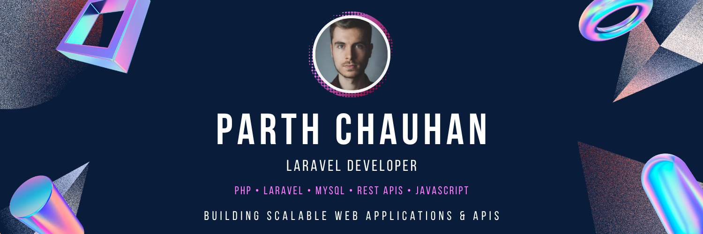

<p align="center">
  
</p>

<h1 align="center">Hi 👋, I'm Parth Chauhan </h1>

<p align="center">
  <strong>Backend Developer | Laravel & Node.js | Full Stack Web Developer</strong>
</p>

<p align="center">
  Building scalable backend systems, REST APIs, CMS platforms, and modern web applications.
</p>

<p align="center">
  <a href="https://github.com/parthchauhan11">
    
  </a>
  <a href="https://github.com/parthchauhan11?tab=followers">
    
  </a>
</p>

---

## 👨‍💻 About Me

I'm a **Backend & Full Stack Web Developer** with **4+ years of experience** building scalable and production-ready web applications.

I specialize in **Laravel, PHP, Node.js, REST APIs, MySQL, React**, and backend architecture. I've worked on **CMS platforms, news portals, API-driven applications, third-party integrations, and real-time systems**.

* 🔥 Backend development with **Laravel & Node.js**
* 🚀 Building scalable **REST APIs & backend services**
* 📰 Experience with **News Portal & CMS platforms**
* ⚡ Real-time applications using **Node.js & WebSockets**
* 🗄️ Database design, optimization & query performance
* 🔐 Authentication using **JWT, OAuth & Laravel Sanctum**
* ☁️ Deployment & server management with **Linux, Nginx & AWS**
* 🌱 Continuously learning modern technologies and architecture patterns
* 📍 Gujarat, India
* 💼 Open to **Backend / Laravel / Node.js / Full Stack opportunities**
* 🤝 Available for interesting freelance projects

---

## 🛠️ Tech Stack

### Backend

<p>
  
  
  
  
  
  
</p>

### Frontend

<p>
  
  
  
  
  
  
  
  
</p>

### Database

<p>
  
  
  
</p>

### DevOps & Tools

<p>
  
  
  
  
  
  
  
</p>

---

## 🚀 What I Build

```text
┌──────────────────────────────────────────────────────┐
│                  Backend Development                  │
├──────────────────────────────────────────────────────┤
│ Laravel Applications        REST APIs                │
│ Node.js Services            Microservices             │
│ CMS Platforms               News Portals             │
│ Authentication              Third-party Integrations │
│ Payment Gateway Integration Real-time Applications    │
│ Database Optimization       Server Deployment        │
└──────────────────────────────────────────────────────┘
```

---

## 🌟 Featured Projects

### 📰 Ahmedabad Mirror

**News Portal & CMS Platform**

* Large-scale news publishing platform
* Laravel-based backend and API architecture
* Article, category and video management
* REST API integrations
* Performance optimization and caching
* Production server and deployment management

### 📰 NavGujarat Samay

**Gujarati News Portal**

* News publishing and CMS platform
* Backend API development
* Article, category and trending content systems
* MongoDB data management
* Redis caching and performance optimization
* Production infrastructure management

### 🎮 Real-Time Multiplayer Game

**Node.js WebSocket Application**

* Real-time multiplayer gameplay
* WebSocket-based communication
* Matchmaking system
* Game logic implementation
* Leaderboards and player management

---

## 📊 GitHub Stats

<p align="center">
  
  
</p>

---

## 🔥 GitHub Streak

<p align="center">
  
</p>

---

## 📈 Contribution Graph

<p align="center">
  
</p>

---

## 🎯 Current Focus

* 🚀 Advanced Laravel architecture
* ⚡ Node.js backend development
* 🔌 API performance & scalability
* 🗄️ Database optimization
* 🧠 Clean Architecture & design patterns
* ☁️ AWS & production infrastructure
* ⚛️ Modern React & Full Stack development

---

## 🤝 Let's Connect

<p align="center">
  <a href="https://github.com/parthchauhan11">
    <img src="https://img.shields.io/badge/GitHub-181717?style=for-the-badge&lo
